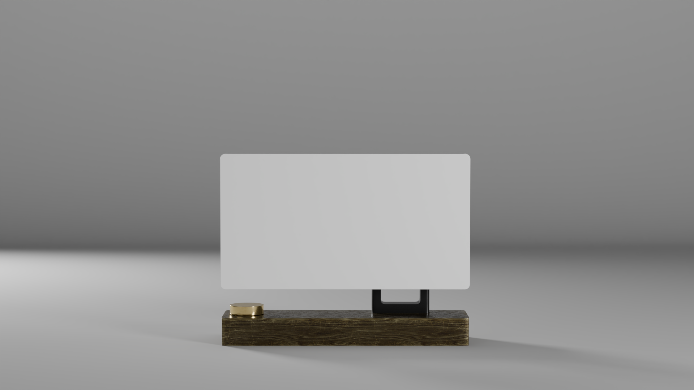

## Overview

> Athunas is a matrix led project, controlled by a Raspberry Pi zero.

The purpose of the project is to provide a framework to add apps and functionality to the "product" (the matrix led + raspberry & accessories).

## Getting Started

- [Overview](#overview)
- [Getting Started](#getting-started)
- [Documentation](#documentation)
- [Key features](#key-features)
  - [Apps](#apps)
  - [Functionalities](#functionalities)
- [Setting up](#setting-up)
  - [Prerequisites](#prerequisites)
  - [Install](#install)
  - [Troubleshooting](#troubleshooting)
- [Contributing](#contributing)
- [Acknowledgments](#acknowledgments)
- [License](#license)

## Documentation

Find here the index of the project documentation:

- [Wiring](./docs/wiring.md)
- [Installation](./docs/installation.md)
- [Configuration](./docs/configuration.md)

For documentation about the `rpi-rgb-led-matrix` library, check their detailed [official documentation](https://github.com/hzeller/rpi-rgb-led-matrix/blob/f0e95d3557dfc60759a290300c184074e9ec5874/README.md).

For any other information, feel free to [open an issue](https://github.com/MorganKryze/Athunas/issues) on the repository.

## Key features

### Apps

- [x] Main screen / Clock
- [x] Gif viewer
- [x] Conways game of life
- [ ] Weather[^1]
- [ ] Notion todo lists[^2]
- [ ] Pomodoro timer
- [ ] Spotify player[^3]
- [ ] Stocks & crypto
- [ ] Youtube subscribers count
- [ ] ...

### Functionalities

- [x] Logging system
- [x] One-file configuration
- [x] Makefile
- [ ] Comprehensive documentation to add new apps
- [ ] Web interface to manage the apps
- [ ] CAD files for 3D printing
- [ ] ...

## Setting up

### Prerequisites

- Matrix led (price, link, etc.);
- Raspberry Pi zero
- Power supply
- SD card
- Raspberry pi imager
- Encoder
- ...

Overall budget: **~$xyz** / **xyz€**

### Install

First, follow the wiring instructions in the [wiring](./docs/wiring.md) guide.

Once everything is set up, we can follow the [installation guide](./docs/installation.md).

### Troubleshooting

For any issues related to the wiring, check the [wiring](./docs/wiring.md) guide or the guide from the [rpi-rgb-led-matrix repository](https://github.com/hzeller/rpi-rgb-led-matrix/blob/master/wiring.md).

For any other issues, feel free to [open an issue](https://github.com/MorganKryze/Athunas/issues) on the repository.

## Contributing

If you want to contribute to the project, you can follow the steps described in the [CONTRIBUTING](./.github/CONTRIBUTING.md) file and get in touch with us at this email: [morgan@kodelab.fr](mailto:morgan@kodelab.fr).

## Acknowledgments

We would like to express our gratitude to the following individuals for their contributions to the start of the project:

- [Allen's lab](https://github.com/allenslab): for the `matrix-dashboard` project, which is a great starting point for building a dashboard using the Matrix platform through his [video](https://www.youtube.com/watch?v=A5A6ET64Oz8).
- [Ty Porter](https://github.com/ty-porter): for bringing public [Allen's lab's project](https://github.com/ty-porter/matrix-dashboard) source code and making it available to the community.
- [Henner Zeller](https://github.com/hzeller): for the `rpi-rgb-led-matrix` library, which is the core of the communication between the Raspberry Pi and the led matrix.
- [Milk And Espresso](https://m.twitch.tv/milkandespresso/about): for making some of the original background images.

Additionally, we would like to thank the following people for their contributions to the project:

- [Dimitry Siebert](https://github.com/foukouda): for bringing the project to life with his CAO expertise and PCB design skills.
- [Yann M. Vidamment](https://github.com/MorganKryze): for adapting Allen's lab project to our needs and vision regarding the software part of the project.

Finally, we would like to thank all the people who tried the project and gave us feedback to improve it.

## License

This project is licensed by the [original author](https://github.com/allenslab) under the GNU GPL v3, which allows you to _use_, _modify_, and _distribute_ the software freely, as long as you **provide the source code** and do not add restrictions that limit others' rights under the same license. For full details, refer to the [LICENSE](LICENSE) file.

[^1]: The weather app is compatible with the [OpenWeatherMap API](https://openweathermap.org/) or [AccuWeather API](https://developer.accuweather.com/). You will need to create an account on their website to get an API key. Although AccuWeather won't require you to enter your credit card details.
[^2]: The Notion todo lists app is compatible with the [Notion API](https://developers.notion.com/). You will need to create an account on their website to get an API key.
[^3]: The Spotify player app is compatible with the [Spotify API](https://developer.spotify.com/). You will need to create an account on their website to get an API key.
