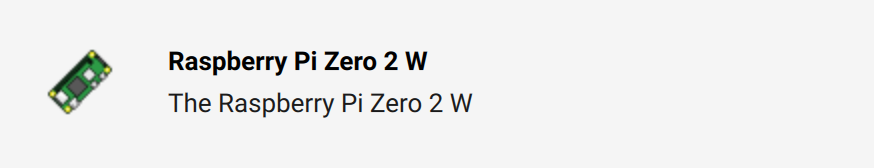
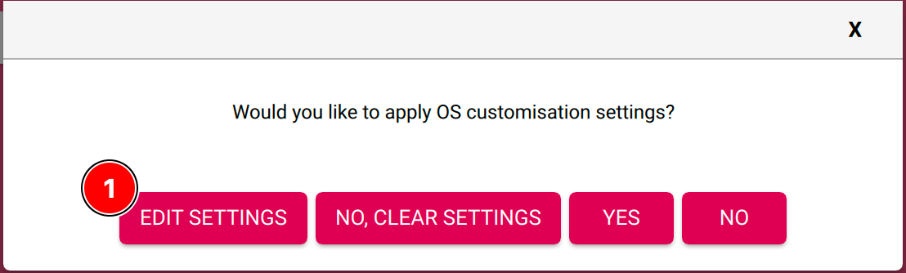
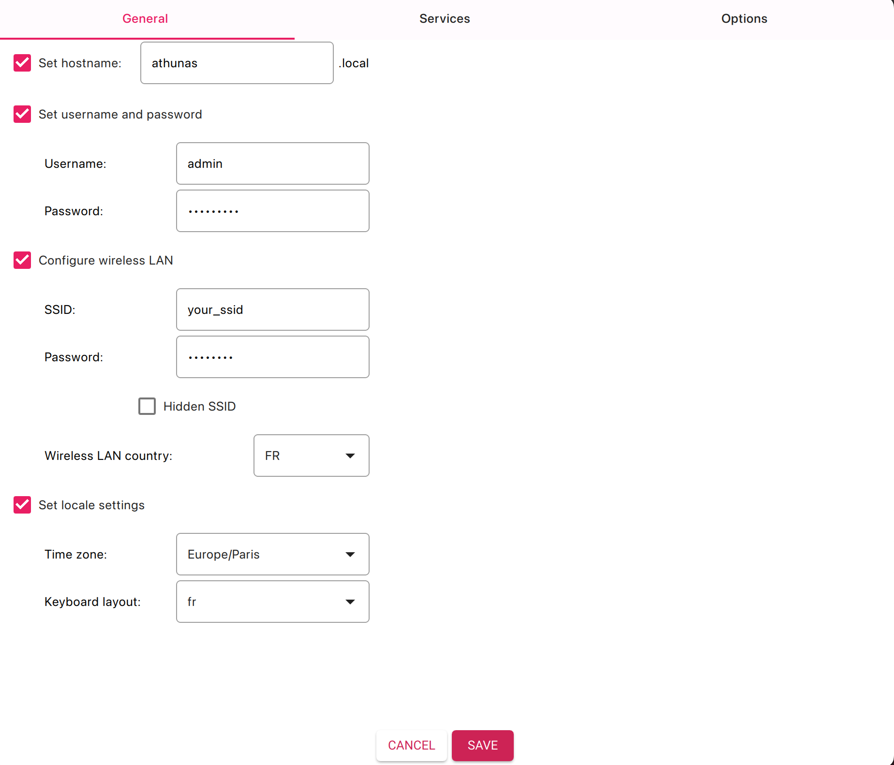
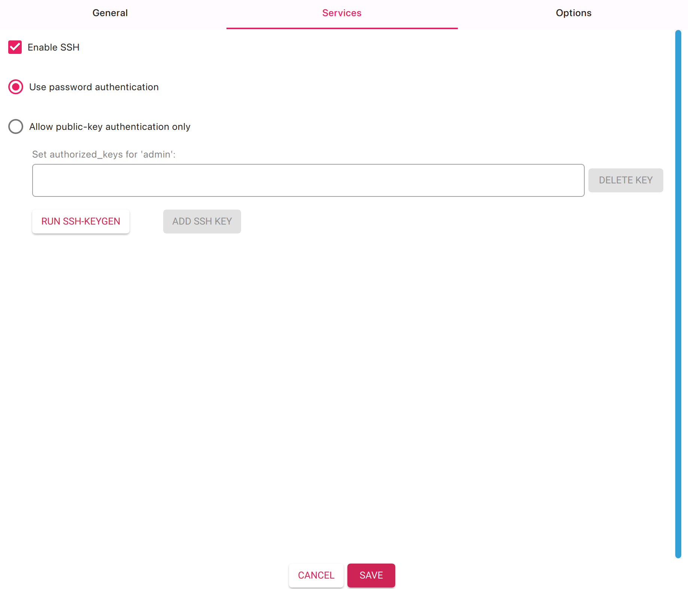

# Manual installation

> This is a step-by-step guide to install the project on your local machine. Proceeding with these steps assume you have done the wiring as described in the [wiring guide](./docs/wiring.md).

## Prepare the Pi

### Configure the OS

First, plug a microSD card (at least 16GB) into your computer and format it using the [Raspberry Pi Imager](https://www.raspberrypi.com/software/) to FAT32 format. The device should be a `Raspberry Pi Zero 2W` or any other model that supports the `rpi-rgb-led-matrix` library.



Then, choose the OS `Raspberry Pi OS Lite` (64-bit) and select the SD card you just formatted.

After pressing "Next", you will be prompted to configure the following settings under the `General` tab:





- **Hostname**: `athunas`
- **Username**: `admin`
- **Password**: `raspberry` (you can change it later)
- **SSID**: `your_ssid` (this is your Wi-Fi network name)
- **Password**: `your_password` (this is your Wi-Fi password)
- **Wireless LAN country**: `your_country` (e.g., `US`, `FR`, etc.)
- **Timezone**: `your_timezone` (e.g., `Europe/Paris`, `America/New_York`, etc.)

In the `Services` tab, enable `SSH` and tick the box to allow `Password authentication` (you may want to go with `Public key` authentication later).



Finally, click on `Save` and `Yes` to write the image to the SD card. Once the process is complete, safely eject the SD card from your computer and plug it into your Raspberry Pi.

### Boot the Pi

- Connect to your machine via SSH (be sure to be connected to the same network) **or** using a monitor + keyboard.

```bash
ssh admin@athunas.local
```

And enter the password you set earlier (`raspberry`).

- Update your system.

```bash
sudo apt-get update && sudo apt-get upgrade -y
```

- Install `git` and `pip`.

```bash
sudo apt install git python3-pip make -y
```

### Few perfomance tweaks

#### Improve performance for Matrix

- Add a small flag at the end of the line to add better results:

```bash
sudo nano /boot/firmware/cmdline.txt
```

```plaintext
isolcpus=3
```

#### Disable sound module

- Edit the file `/etc/modprobe.d/raspi-blacklist.conf` and add the following line:

```bash
sudo nano /etc/modprobe.d/blacklist-rgb-matrix.conf
```

```bash
blacklist snd_bcm2835
```

- Update the kernel modules.

```bash
sudo update-initramfs -u
```

- Reboot the Raspberry Pi.

```bash
sudo reboot
```

## Install the project

- Clone the repository.

```bash
git clone --recurse-submodules https://github.com/MorganKryze/Athunas.git
```

- Change directory to the project.

```bash
cd Athunas
```

## Build & Run

- We use our `Makefile` to install the project dependencies.

```bash
make setup
```

- (Optional) If and only if you did the wiring, you may try the demo.

```bash
make example
```

> [!TIP]
> If you get any error with the display, open the `Makefile` and try the following steps:
>
> - Add/remove: `--led-no-hardware-pulse`;
> - Check the wiring;
> - Breathe in, breathe out, do it again.

- Finally, run the project.

```bash
make run
```
