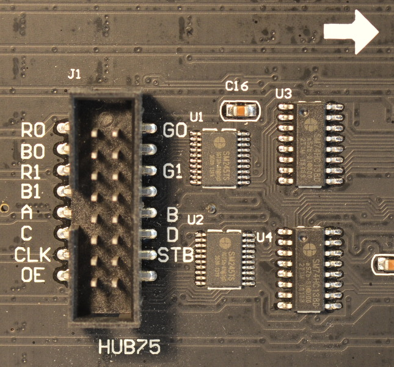
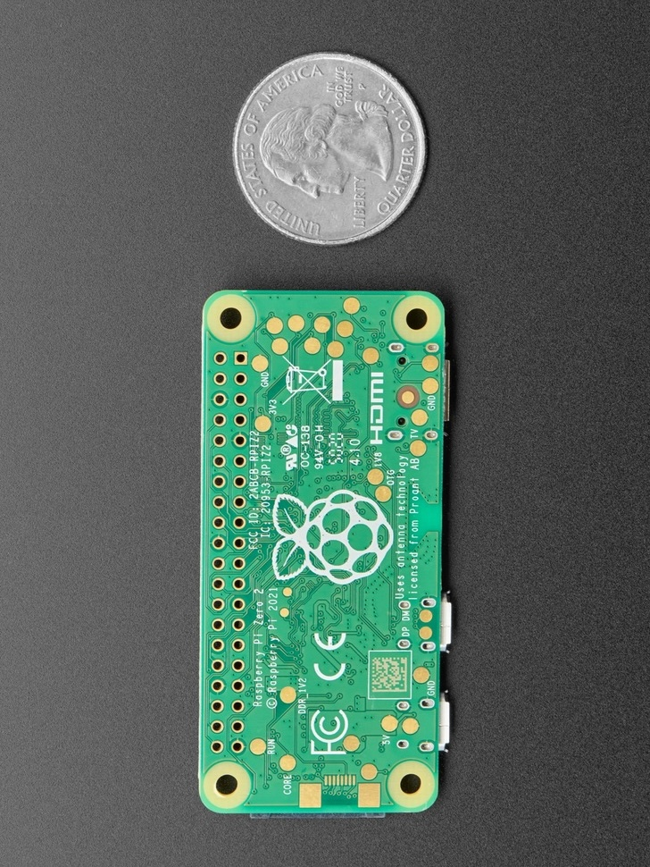

# Wiring

> Welcome to the wiring guide. Here you will find the necessary information to connect the Raspberry Pi to the matrix led.

Here are both the pinout of the Raspberry Pi and the led matrix. You may connect them according by their corresponding pins (e. g. **R0** to **R0**).

## Led matrix pinout

Here is a capture of the led matrix pinout:

| Connection | Pin | Pin | Connection |
| ---------: | :-: | :-: | :--------- |
|     **R0** |  2  |  1  | **G0**     |
|     **B0** |  4  |  3  | **GND**    |
|     **R1** |  6  |  5  | **G1**     |
|     **B1** |  8  |  7  | **GND**    |
|      **A** | 10  |  9  | **B**      |
|      **C** | 12  | 11  | **D**      |
|    **CLK** | 14  | 13  | **STB**    |
|    **OE-** | 16  | 15  | **GND**    |

## Raspberry Pi pinout

> [!WARNING]
> Here the pinout is flipped as it was more convenient for us to put the Raspberry Pi on a future PCB. If you intend to use your Rpi in the default position, the reverse pinout is just below.

| Connection | Pin | Pin | Connection |
| ---------: | :-: | :-: | :--------- |
|          - |  2  |  1  | -          |
|          - |  4  |  3  | -          |
|    **GND** |  6  |  5  | -          |
|          - |  8  |  7  | **STB**    |
|          - | 10  |  9  | -          |
|    **OE-** | 12  | 11  | **CLK**    |
|          - | 14  | 13  | **G0**     |
|      **B** | 16  | 15  | **A**      |
|      **C** | 18  | 17  | -          |
|          - | 20  | 19  | **B1**     |
|      **D** | 22  | 21  | **G1**     |
|     **R1** | 24  | 23  | **R0**     |
|     **B0** | 26  | 25  | -          |
|          - | 28  | 27  | -          |
|          - | 30  | 29  | -          |
|          - | 32  | 31  | -          |
|    **GND** | 34  | 33  | -          |
|          - | 36  | 35  | -          |
|          - | 38  | 37  | -          |
|          - | 40  | 39  | **GND**    |

The front Pi pinout is as follows:

| Connection | Pin | Pin | Connection |
| ---------: | :-: | :-: | :--------- |
|          - |  1  |  2  | -          |
|          - |  3  |  4  | -          |
|          - |  5  |  6  | **GND**    |
|    **STB** |  7  |  8  | -          |
|          - |  9  | 10  | **E**      |
|    **CLK** | 11  | 12  | **OE-**    |
|     **G0** | 13  | 14  | -          |
|      **A** | 15  | 16  | **B**      |
|          - | 17  | 18  | **C**      |
|     **B2** | 19  | 20  | -          |
|     **G2** | 21  | 22  | **D**      |
|     **R0** | 23  | 24  | **R1**     |
|          - | 25  | 26  | **B0**     |
|          - | 27  | 28  | -          |
|          - | 29  | 30  | -          |
|          - | 31  | 32  | -          |
|          - | 33  | 34  | **GND**    |
|          - | 35  | 36  | -          |
|          - | 37  | 38  | -          |
|    **GND** | 39  | 40  | -          |

## Conclusion

Now that you have connected the Raspberry Pi to the led matrix, you can move on to the installation guide.
